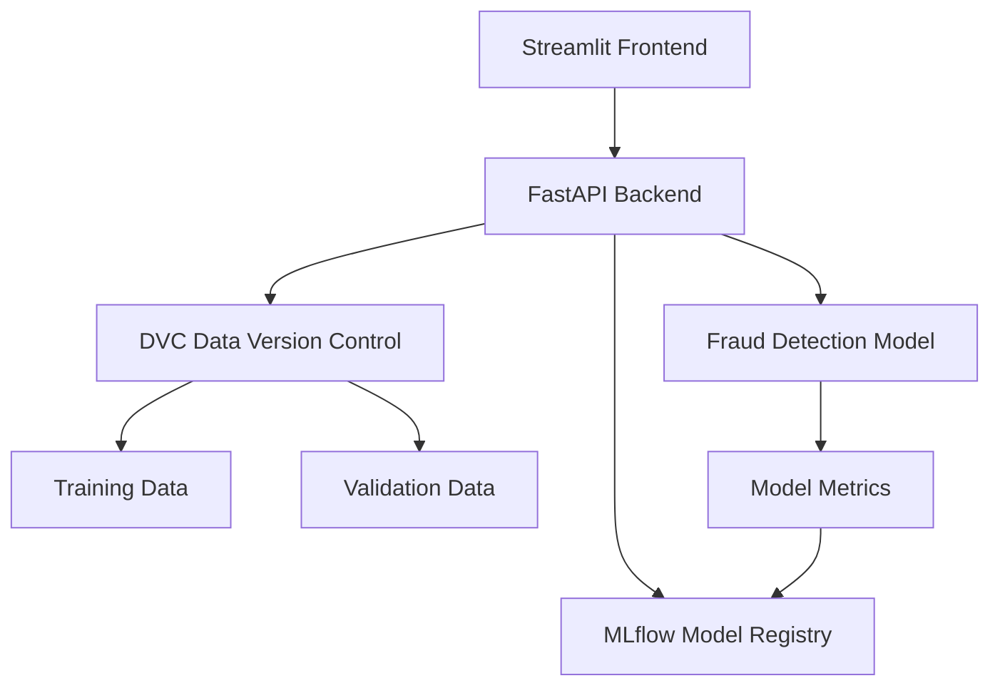

# Fraud Detection System with MLflow and DVC

This project implements a fraud detection system using machine learning, with proper version control for both models and data using MLflow and DVC (Data Version Control).

## Project Architecture



## Project Structure

```
fraud-detection/
├── frontend/
│   ├── app.py                 # Streamlit frontend application
│   └── requirements.txt       # Frontend dependencies
├── backend/
│   ├── app/
│   │   ├── __init__.py
│   │   ├── main.py           # FastAPI application
│   │   ├── models.py         # Data models
│   │   └── services.py       # Business logic
│   ├── ml/
│   │   ├── train.py          # Model training script
│   │   └── predict.py        # Model prediction script
│   └── requirements.txt      # Backend dependencies
├── data/
│   └── .gitignore           # DVC data directory
├── dvc.yaml                 # DVC configuration
├── mlflow.yaml             # MLflow configuration
└── README.md               # Project documentation
```

## Setup Instructions

### Prerequisites

1. Python 3.8 or higher
2. Git
3. DVC
4. MLflow

### Installation Steps

1. Clone the repository:
```bash
git clone <repository-url>
cd fraud-detection
```

2. Install DVC and MLflow:
```bash
pip install dvc mlflow
```

3. Initialize DVC:
```bash
dvc init
```

4. Configure DVC remote storage (optional but recommended):
```bash
# For local storage
dvc remote add -d myremote /path/to/remote/storage

# For cloud storage (e.g., S3)
dvc remote add -d myremote s3://my-bucket/dvc-storage
```

5. Set up MLflow tracking:
```bash
# Start MLflow tracking server
mlflow server --host 0.0.0.0 --port 5000
```

6. Create necessary directories:
```bash
mkdir -p data/raw
mkdir -p data/processed
mkdir -p data/models
mkdir -p mlruns
```

7. Install project dependencies:
```bash
# Create and activate virtual environment
python -m venv venv
source venv/bin/activate  # On Windows: venv\Scripts\activate

# Install dependencies
pip install -r backend/requirements.txt
pip install -r frontend/requirements.txt
```

### Running the Pipeline

1. Generate synthetic data:
```bash
dvc run -n generate_data
```

2. Train the model:
```bash
dvc run -n train_model
```

3. Start the services:
```bash
# Start backend (from backend directory)
uvicorn app.main:app --reload

# Start frontend (from frontend directory)
streamlit run app.py
```

### Monitoring and Version Control

1. **MLflow UI**:
   - Access at http://localhost:5000
   - View experiment runs
   - Compare model metrics
   - Track model versions
   - Monitor data statistics

2. **DVC Commands**:
   ```bash
   # View data changes
   dvc diff data/raw/transactions.csv
   dvc diff data/processed/transactions_processed.csv

   # View pipeline
   dvc dag

   # Push changes to remote storage
   dvc push

   # Pull changes from remote storage
   dvc pull
   ```

3. **Git Integration**:
   ```bash
   # Add DVC files to git
   git add dvc.yaml dvc.lock .dvc/config
   git commit -m "Add DVC configuration"

   # Push to remote repository
   git push origin main
   ```

### Data Versioning

The project uses DVC to version control:
- Raw transaction data (`data/raw/transactions.csv`)
- Processed data (`data/processed/transactions_processed.csv`)
- Model artifacts (`data/models/fraud_detection_model.pkl`)

### Model Versioning

MLflow tracks:
- Model parameters
- Training metrics
- Model artifacts
- Feature importance
- Data statistics

## Features

- Real-time fraud detection using machine learning
- Interactive web interface using Streamlit
- RESTful API using FastAPI
- Model versioning and tracking with MLflow
- Data versioning with DVC
- Model performance monitoring
- Data pipeline automation

## Contributing

1. Fork the repository
2. Create a feature branch
3. Commit your changes
4. Push to the branch
5. Create a Pull Request

## Troubleshooting

1. **MLflow Connection Issues**:
   - Ensure MLflow server is running
   - Check MLFLOW_TRACKING_URI environment variable
   - Verify network connectivity

2. **DVC Storage Issues**:
   - Check remote storage configuration
   - Verify storage permissions
   - Ensure sufficient storage space

3. **Data Pipeline Issues**:
   - Check DVC pipeline status
   - Verify data dependencies
   - Review error logs 