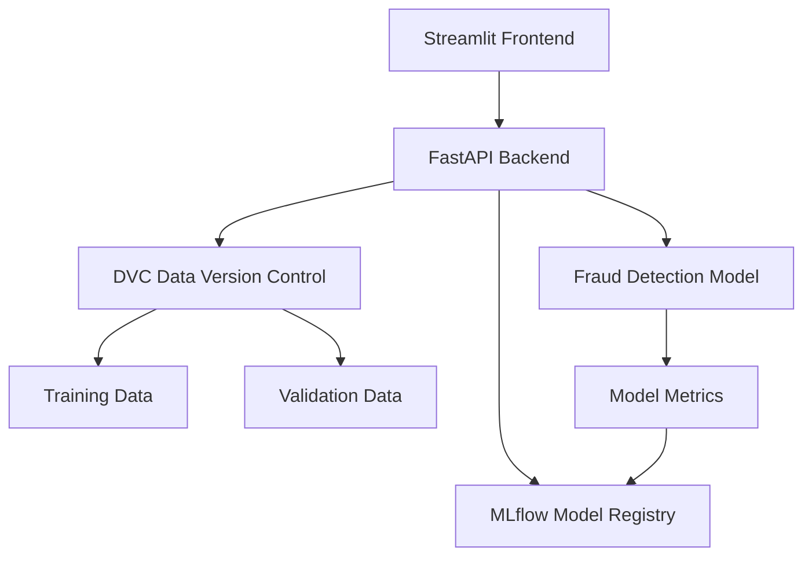

# Fraud Detection System with MLflow and DVC

This project implements a fraud detection system using machine learning, with proper version control for both models and data using MLflow and DVC (Data Version Control).

## Project Architecture



## Project Structure

```
fraud-detection/
├── frontend/
│   ├── app.py                 # Streamlit frontend application
│   └── requirements.txt       # Frontend dependencies
├── backend/
│   ├── app/
│   │   ├── __init__.py
│   │   ├── main.py           # FastAPI application
│   │   ├── models.py         # Data models
│   │   └── services.py       # Business logic
│   ├── ml/
│   │   ├── train.py          # Model training script
│   │   └── predict.py        # Model prediction script
│   └── requirements.txt      # Backend dependencies
├── data/
│   └── .gitignore           # DVC data directory
├── dvc.yaml                 # DVC configuration
├── mlflow.yaml             # MLflow configuration
└── README.md               # Project documentation
```

## Features

- Real-time fraud detection using machine learning
- Interactive web interface using Streamlit
- RESTful API using FastAPI
- Model versioning and tracking with MLflow
- Data versioning with DVC
- Model performance monitoring
- Data pipeline automation

## Setup Instructions

1. Clone the repository:
```bash
git clone <repository-url>
cd fraud-detection
```

2. Set up virtual environment:
```bash
python -m venv venv
source venv/bin/activate  # On Windows: venv\Scripts\activate
```

3. Install dependencies:
```bash
# Install backend dependencies
cd backend
pip install -r requirements.txt

# Install frontend dependencies
cd ../frontend
pip install -r requirements.txt
```

4. Initialize DVC:
```bash
dvc init
```

5. Start the services:
```bash
# Start backend (from backend directory)
uvicorn app.main:app --reload

# Start frontend (from frontend directory)
streamlit run app.py
```

## Usage

1. Access the Streamlit frontend at `http://localhost:8501`
2. The FastAPI backend will be available at `http://localhost:8000`
3. MLflow tracking server can be accessed at `http://localhost:5000`
4. DVC remote storage can be configured in `dvc.yaml`

## Model Training

To train a new model:
```bash
cd backend
python ml/train.py
```

## API Documentation

Once the backend is running, visit `http://localhost:8000/docs` for the interactive API documentation.

## Contributing

1. Fork the repository
2. Create a feature branch
3. Commit your changes
4. Push to the branch
5. Create a Pull Request 